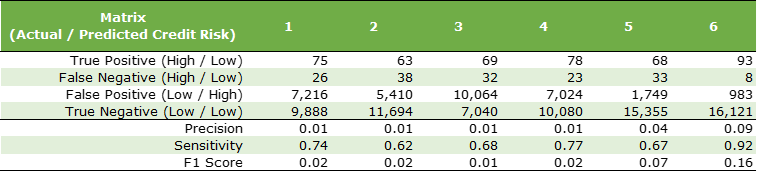

# SupervisedMachineLearning
Module 17 of UofT Data Analytics Boot Camp

## Overview
#### Objective
The objectives of the module are to;
* Implement several machine learning models to predict credit risk and
* Evaluate the performance of models and provide recommendation on the model to use, if any.

#### Resources
* Software / Services: Jupyter Lab
* Programming Language: Python
* Data: LoanStats_2019Q1.csv

## Machine Learning Models
1. Logistic Regression Model with Naive Random Over-Sampling
2. Logistic Regression Model with SMOTE Over-Sampling
3. Logistic Regression Model with the Cluster Centroids Under-Sampling
4. Logistic Regression Model with SMOTEENN (Over & Under) Sampling
5. Balanced Random Forest Classifier
6. Easy Ensemble AdaBoost Classifier

## Results
Table below summarizes the confusion matrix of each model.

* All logistic regression models have low scores in all metrics (Precision, Sensitivity and F1 Score) of the minority (High Risk) class.
* Balanced Random Forest Classifier has slightly improved Precision and F1 Score compared to logistic regression models. However, these values are still low. It also does not have sufficient Sensitivity.
* Easy Ensemble AdaBoost Classifier (EEABC) has high Sensitivity of above 90%. However Precision and F1 Score are still low.

## Recommendation
None of the supervised machine learning models tested showed the sufficient performance for the model to be used as single method to assess the credit risk of the customer. However, EEABC could be used as a preliminary screening tool provided that there are additional assessment and risk mitigation put in place.

* The most important metrics is the sensitivity of the model as False Negative (High Risk assessed as Low Risk) can cause a severe loss to the company
* As 8% of High Risk is stil miss-classified by EEABC, the result cannot be used as the complete assessment. 
* However, for the initial screening of the customer, it can significantly reduce the workload required to assess all customers (by approx. 95%).
* For all customers tested as positive, additional assessment with more detail could be performed as 90% of them are could still be good customer.
* More importantly, to mitigate the risk of False Negative, some additional mitigation strategies should be placed such as placing an load limit. If loan amount is higher than a certain value, additional assessment should be performed despite the EEABC test result.